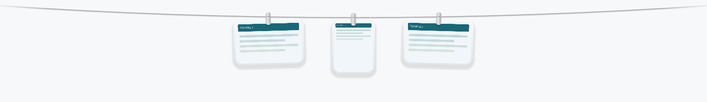
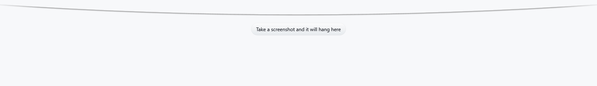
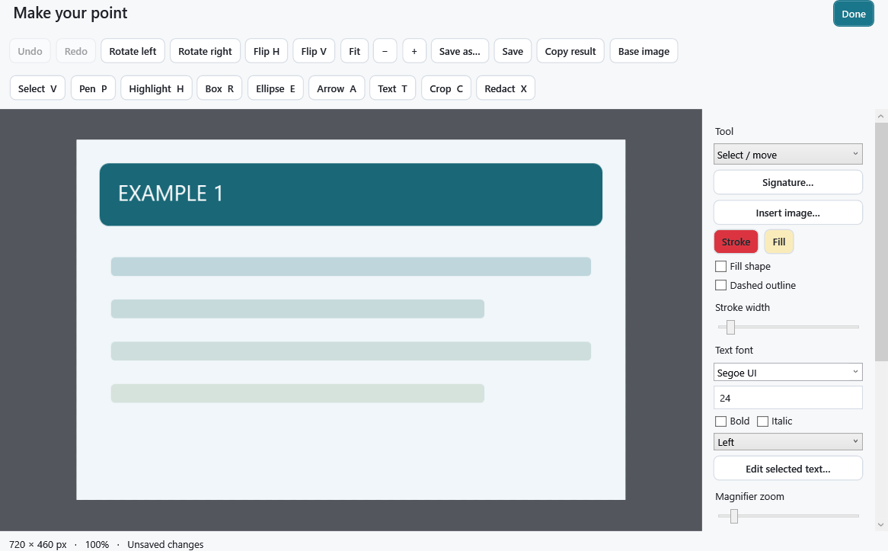
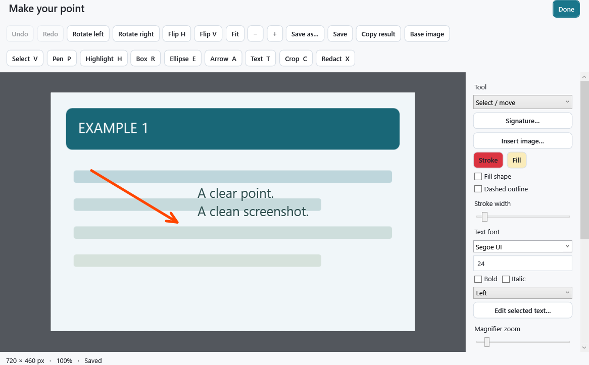
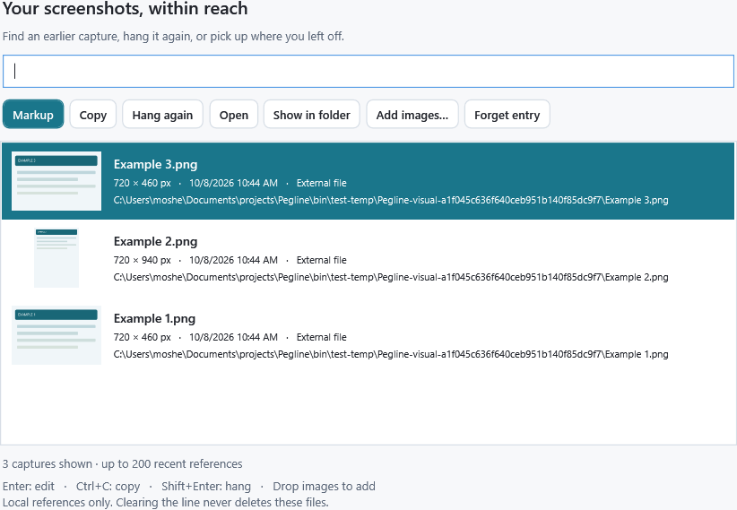

# Pegline

A little screenshot clothesline for Windows, inspired by [Tendedero](https://github.com/alejandrobujan/tendedero).

Capture your screen, keep images within reach, and annotate them without leaving your workflow. Free, local, and open source. No accounts or telemetry.

**[Website & interactive demos](https://pegline-windows-builds.meanin2.chatgpt.site)** · **[Download Windows beta](https://github.com/meanin2/pegline/releases/tag/v0.2.1-beta.2)**

## See it in action

Keep screenshots on the shelf.

Add arrows and text, then undo an edit.

Automated native-renderer demos with sample images. The website also offers browser simulations.

## Install

**Windows 11 x64 · .NET Framework 4.8 or 4.8.1**

1. Visit the [public website](https://pegline-windows-builds.meanin2.chatgpt.site) and click **Download Windows beta**, or download the `Pegline-…-win-x64.zip` asset from [Releases](https://github.com/meanin2/pegline/releases/tag/v0.2.1-beta.2).
2. Right-click the ZIP → **Extract All**. Choose a folder such as `Documents\Pegline`.
3. Open **`Pegline.exe`**. Keep **`Pegline.exe.config`** beside it. No installer or administrator rights needed.
4. Find Pegline in the system tray, including hidden icons. Press **`Ctrl+Alt+4`** to capture a region; **`Ctrl+Alt+T`** shows or hides the shelf.

This beta is unsigned; Windows may show a publisher warning. [Installation, checksums, updates, and removal](docs/INSTALL.md).

## Capture. Annotate. Find it again.

- **Capture:** region, window, monitor, or freehand.
- **Shelf:** click to copy, hold to annotate, drag to share.
- **Markup:** arrows, text, highlighting, crop, redaction, undo.
- **Library:** search recent images and hang them again.

Actual Windows WPF views with sample images.

Beta: automated Windows checks pass; full desktop interaction testing remains ongoing. [Verification](VERIFICATION.md) · [Build from source](docs/BUILDING.md) · [License & credits](THIRD_PARTY_NOTICES.md)
